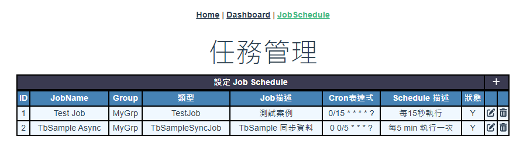
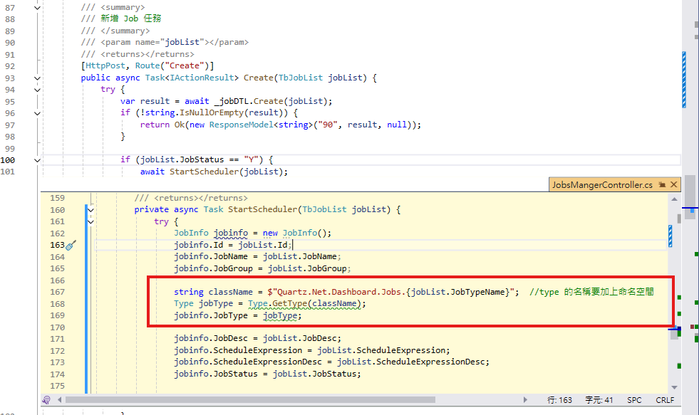
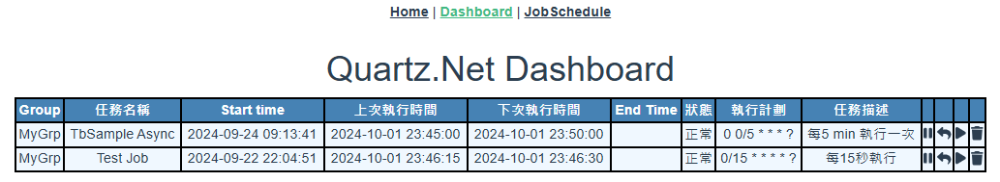

---
html:
    toc: true
    # number_sections:true
    top_depth: 6
    foc_float: true
      collspased: true
      smooth_scroll: true
---

# Quartz.Net-Dashboard
Quartz.Net 持久化及 SignalR Core Dashboard的作法

## 目錄
- [Quartz.Net-Dashboard](#quartznet-dashboard)
  - [目錄](#目錄)
    - [環境](#環境)
    - [專案目的](#專案目的)
    - [一﹑基礎建置](#一基礎建置)
    - [二﹑建立 Quartz Service](#二建立-quartz-service)
    - [三﹑建置 SignalR Hub](#三建置-signalr-hub)
    - [四﹑建立監聽器](#四建立監聽器)
    - [五﹑建立 Job](#五建立-job)
    - [六﹑建立 Job 任務管理介面](#六建立-job-任務管理介面)
    - [七﹑製作前端介面](#七製作前端介面)
    - [後記](#後記)
    - [參考資料](#參考資料)

### 環境
資料庫：MSSQLLocal  
.Net 版本：8  
安裝套件：  
  * Microsoft.EntityFramworkCore  
  * Microsoft.EntityFramworkCore.Design  
  * Microsoft.EntityFramworkCore.SqlServer  
  * Microsoft.EntityFramworkCore.Tools  
  * Microsoft.Data.SqlClient  
  * Quartz  
  * Quartz.AspNetCore  
  * Quartz.Serialization.Json  
  * Serilog.AspNetCore  
  * Dapper  

### 專案目的
建立 Quartz.Net Dashboard, 主要是能提供介面對 Job 任務進行管理﹐如新增 Job﹑修改 Job 行程﹑暫停 Job 行程(暫停時間範圍)﹑刪除 Job 行程, 由 Job 任務管理介面進行 Job 排程的啟動或停止, 而實際執行的 Job 排程可經由 Dashboard 介面來觀察與監控, Dashboard 還可檢視目前 Job 的執行狀況。本專案以 .Net Core Web API 建置 Quartz.Net 並提供 API 給前端 Dashboard 資料, 利用 Microsoft SignalR Core 即時通訊來更新資料.

### 一﹑基礎建置
建立一個 dbQuartzNet 資料庫﹐執行 Quartz 官網提供的 MS SQL schema, 加入Quartz 持久化相關的 table([Quartz.Net Table](https://github.com/quartznet/quartznet/tree/main/database/tables)). 另外新增幾個自訂的資料表。  
`TbJobList` 是提供 新增/異動/刪除 要執行的 Job 任務類別的資料  
`TbSample` 是測試用資料表  
`TbSampleSync` 是測試將 TbSample 資料同步至 TbSampleSync  

新增 .Net Core Web API 專案 Quartz.Net.Dashboard
`appsetting.json` 中加入 Quartz 與資料庫連線設定  
```c#{.line-numbers}
{
  "ConnectionStrings": {
    "DefaultConnection": "Server=(localdb)\\mssqllocaldb;Database=dbQuartzNet;Trusted_Connection=True;MultipleActiveResultSets=true"
  },
  "Quartz": {
    "quartz.scheduler.instanceName": "Quartz.Net.Demo",
  }
}
```

`Program.cs` 先加入 Quartz.Net 持久化相關設定
```c#{.line-numbers}
    builder.Services.AddQuartz(q => {
        // 使用持久化儲存, 連線資料庫為appseggint.json 中設定的 DefaultConnection 連線字串
        q.UsePersistentStore(s => {
            s.UseProperties = false;
            s.RetryInterval = TimeSpan.FromSeconds(30);
            s.UseSqlServer(mssql => {
                mssql.ConnectionString = builder.Configuration.GetConnectionString("DefaultConnection").ToString();
                mssql.TablePrefix = "QRTZ_";
            });
            s.UseNewtonsoftJsonSerializer();
            s.UseClustering(c => {
                c.CheckinMisfireThreshold = TimeSpan.FromSeconds(20);
                c.CheckinInterval = TimeSpan.FromSeconds(10);
            });
        });

        q.UseMicrosoftDependencyInjectionJobFactory();
        q.UseDedicatedThreadPool(tp => {
            tp.MaxConcurrency = 10;
        });
    });

    builder.Services.AddQuartzHostedService(options => {
        options.WaitForJobsToComplete = true;
    });
```
  

### 二﹑建立 Quartz Service
建立 Service `IQuartzScheduleService`, 這裏提供 Quartz 排程的新增﹑暫停﹑刪除及查詢的方法, 這些方法也是後續 SignalR Hub 要調用的方法
```c#{.line-numbers}
    public interface IQuartzScheduleService {
        // 取得所有 Job
        public Task<IEnumerable<JobDetailList>> GetAllJob();

        // 加入新任務到 Quartz.Net 持久化資料庫中開始排程
        public Task<ResponseModel<string>> AddSchedule(JobInfo jobinfo);

        // 暫停 Job 執行
        public Task<ResponseModel<string>> SuspendJob(JobKey jobKey);

        // 恢復 Job 執行
        public Task<ResponseModel<string>> ResumeJob(JobKey jobKey);

        // 刪除 Job
        public Task<ResponseModel<string>> DeleteJob(JobKey jobKey);

        // 建立 Job
        public IJobDetail CreateJobDetail(JobDetailList jobDetailList);

        // 建立 Trigger
        public ITrigger CreateTrigger(JobDetailList jobDetailList);
    }
```
  
  
### 三﹑建置 SignalR Hub
Dashboard 是利用 Microsfot SignalR Core 進行通訊, 新增 ScheduleHub.cs 檔案  
Hub 中提供的方法是查詢所有的 Job﹑暫停﹑重啟和刪除 指定的 Job, 主要是呼叫 IQuartzScheduleService 提供的方法  
在 Program.cs 中需要注入並註冊 SignalR Core 
```c#{.line-numbers}
...略
#region SignalR
builder.Services.AddSingleton<ScheduleHub>();
builder.Services.AddSignalR();
#endregion

var app = builder.Build();
...略
app.MapHub<ScheduleHub>("/scheduleHub");
app.Run();
```

然後在 ScheduleHub.cs 中撰寫 NotifyJobStatusChange() 方法﹐這方法用來通知前端排程狀態的改變, 當中呼叫了前端 Javascript 的 JobStatusChange 方法,  所以記得前端必須撰寫一個 JobStatusChange 方法。  
之後就是撰寫以下的方法提供給瀏覽器端的 Javascript 呼叫, 以下的這些方法主要就是調用前面 IQuartzScheduleService 提供的方法    
`GetAllJobs` 查詢 Quartz 持久化資料庫中所有的排程  
`SuspendJob` 對 Quartz 執行中的排程的某一個指定的排程暫停  
`ResumeJob`  將暫停的排程恢復執行  
`DeleteJob`  刪除指定的排程  


### 四﹑建立監聽器
Quartz 提供了多種的監聽器(Listener) , 目前只先用了 JobListener, 透過 JobListener 中的 JobWasExecuted 和 JobToBeExecuted 方法分別監聽 Job 執行前和執行後的通知, 再藉由呼叫 SignalR Hub 提供的 NotifyJobStatusChange() 方法來及時更新前端的訊息顯示  
```c#{.line-numbers}
 public async Task JobWasExecuted(IJobExecutionContext context, JobExecutionException? jobException, CancellationToken cancellationToken = default) {
     try {               
         // 工作執行完畢 (目前 Job 狀態尚未移出 Executing 清單)
         var jobName = context.JobDetail.Key.Name;
         _logger.LogInformation($"{DateTime.Now:yyyy/MM/dd HH:mm:ss} - JobListener job {jobName} - Job 執行結束!");

         using (var scope = _serviceScopeFactory.CreateScope()) {
             var scheduleHub = scope.ServiceProvider.GetRequiredService<ScheduleHub>();
             await scheduleHub.NotifyJobStatusChange();
         }
     } catch (Exception er) {
         _logger.LogError($"JobListener JobWasExecuted error:{er.Message}");
     }
 }

 public async Task JobToBeExecuted(IJobExecutionContext context, CancellationToken cancellationToken = default) {
     try {
         // 工作將被執行(目前 Job 尚未進入 Executing 清單)
         var jobName = context.JobDetail.Key.Name;
         _logger.LogInformation($"{DateTime.Now:yyyy/MM/dd HH:mm:ss} - JobListener job {jobName} - Job 即將執行!");

         using (var scope = _serviceScopeFactory.CreateScope()) {
             var scheduleHub = scope.ServiceProvider.GetRequiredService<ScheduleHub>();
             await scheduleHub.NotifyJobStatusChange();
         }
     } catch (Exception er) {
         _logger.LogError($"JobListener JobToBeExecuted error:{er.Message}");
     }
 }
```
  

### 五﹑建立 Job
要建立一支 Job 非常簡單, 繼承 IJob 後將需要的作業撰寫於 Execute 方法中就可以, 以下是一個非常簡單的例子
```C#{.line-numbers}
namespace Quartz.Net.Dashboard.Jobs {
    public class TestJob : IJob {
        private readonly ILogger<TestJob> _logger;

        public TestJob(ILogger<TestJob> logger) {
            _logger = logger;
        }

        public async Task Execute(IJobExecutionContext context) {
            try {
                _logger.LogInformation($"{DateTime.Now:yyyy/MM/dd HH:mm:ss}\tTestJob start.");
                Console.WriteLine($"{DateTime.Now:yyyy/MM/dd HH:mm:ss}\t這裏執行 TestJob 成功!");
            } catch (Exception er) {
                _logger.LogError($"{DateTime.Now:yyyy/MM/dd HH:mm:ss}\tTestJob error.\t{er.Message}");
                Console.WriteLine($"{DateTime.Now:yyyy/MM/dd HH:mm:ss}\t這裏執行 TestJob 失敗!{er.Message}");
            }
        }
    }
}
```
在範例中另外撰寫了 TbSampleSyncJob 是模擬要定時讀取 TbSample 資料表同步至 TbSampleSync 資料表, 比較貼近實務的作業。  
  

### 六﹑建立 Job 任務管理介面
在前面提到自訂了一個 `TbJobList` 的資料表, 這是要用來管理所有的任務。 在實務上一個系統可能會有一些後端批次作業的 Job 要處理, 也許是要轉檔備份, 也許為了報表在半夜產生資料, 也可能為了某些需求需要定期串接別的系統檢查或取得資料..., 系統的規模和使用者的需求讓後端的批次作業在不同時間可能增加或減少, 所以建置了一個資料表來做這些後端批次作業的管理, 而前面 Quartz 的排程就是根據這個資料表來產生排程。  
  
介面本身沒什麼特別, 不過在新增資料時會直接加入 schedule 排程, 在設計的 TbJobList 中有一欄 JobTypeName 是存放要執行的 Job class 名稱, 大小寫必須要符合 class 的名稱, 也就是在前面第五節中建立的 Job class    
  

Job 建立後就可以在 Dashboard 的介面中看到結果  
  
Dashboard 介面的訊息是由 SingleR 來提供的, 所以仔細觀察介面, 上次執行和下次執行時間是會變更的。  
  

### 七﹑製作前端介面
UI 部分採用 Vue 3 + Vite, 因為採用 SignalR core 做為通訊, 所以需要安裝相關套件
```npm{.line-numbers}
npm install @microsoft/signalr
```
SignalR Core 和 SignalR 2.x 有一點很大不同就是擺脫了 jQuery 的依賴, 2.x 安裝時預設的 jQuery 印象中是 1.6 版, 可以手動換成更高的 1.x 版本, 但 1.x 版在弱掃軟體中常被掃出問題, 如果公司有要求要沒有弱點這就麻煩了, 當然也可以換成 3.x 的版本, 不過寫法上要有些調整就是了。 SignalR Core 擺脫 jQuery 變的更輕量也不用被束縳, 這是一件好事﹐可是在 2.x 有一個好功能自我裝載 self-host 似乎不見了, 實在很可惜。 

在程式中先註冊 signalr hub
```javascript{.line-numbers}
import * as signalr from "@microsoft/signalr";

//const conn = new signalr.HubConnectionBuilder().withUrl("https://localhost:7176/scheduleHub").configureLogging(signalr.LogLevel.Debug).build();
const conn = new signalr.HubConnectionBuilder()
  .withUrl(import.meta.env.VITE_HTTPS + "/scheduleHub")
  .configureLogging(signalr.LogLevel.Debug)
  .build();

export default conn;
```

那麼舉個查詢的例子來看
```javascript{.line-numbers}
import myHub from "@/libs/myHub";
...

// 取得 Job 資料集
const getAllJobs = async () => {
    if (myHub.state.toString() !== "Connected") {
        console.log("SignalR 還未連線");
        await myHub.start();
    }

    try {
        const result = await myHub.invoke("getAllJobs"); // call signalr method
        console.log("getAllJobs result", result.data);
        jobs.value = result.data;
    } catch (er) {
        console.log(`取得所有 Job 資料錯誤 getAllJobs error!--[${er.toString()}]`);
    }
};
...
```
一開始先檢查 signalr 是否已連線, 若還未連線先進行連線 await myHub.start(), 接下就是透過 invoke 呼叫 getAllJobs, `getAllJobs` 是前面第三節 SignalR Hub 中提到提供的方法 `GetAllJobs`, 不過這裏要注意首字要改小寫, 有用過 SignaR 的朋友們應該知道。 這樣 SignalR 會自動透過 WebSocket 或當下其它可用的通訊方式取得資料, 拿到資料後就可以渲染成所要呈現的樣子了。  


### 後記
這個介面還有項功能未完成, Quartz 本身有暫停的方法可以呼叫, 將 Job 暫停, 我更希望能提供暫停時間區間, 過了暫停的時間區間後 Job 能夠自動繼續執行, 我想有做系統維運的應該都了解很多作業常在半夜進行, 如果 Job 只為了配合別人系統的作業需要暫停執行, 這時如果能夠有時間設定讓 Job 在要求的時間內不要作業, 而不用讓人在電腦前乾等著配合別人, 那該是多好的事。 後續有時間再來補上這個功能。  


### 參考資料
- [Quartz.NET](https://www.quartz-scheduler.net/)
- [.Net Core 之 （Hangfire 和 Quertz）定时任务](https://www.cnblogs.com/roubaozidd/p/17144703.html)
- [Quartz.net 3.x使用总结(一)——简单使用](https://www.cnblogs.com/wyy1234/p/10278521.html)
- [Quartz.net 3.x使用总结(二)——Db持久化和集群](https://www.cnblogs.com/wyy1234/p/10347049.html)
- [[ASP.NET Core] 將 Quartz.Net 排程作業 Host 於 ASP.NET Core 網站中，並以 SignalR 實現 Dashboard 頁面](https://dotblogs.com.tw/wasichris/2020/12/16/172524)
- [NetCore中Quartz的后台任务界面化，类似与HangfireDashboard的QuartzDashboard初版](https://blog.csdn.net/weixin_43872830/article/details/124234102)